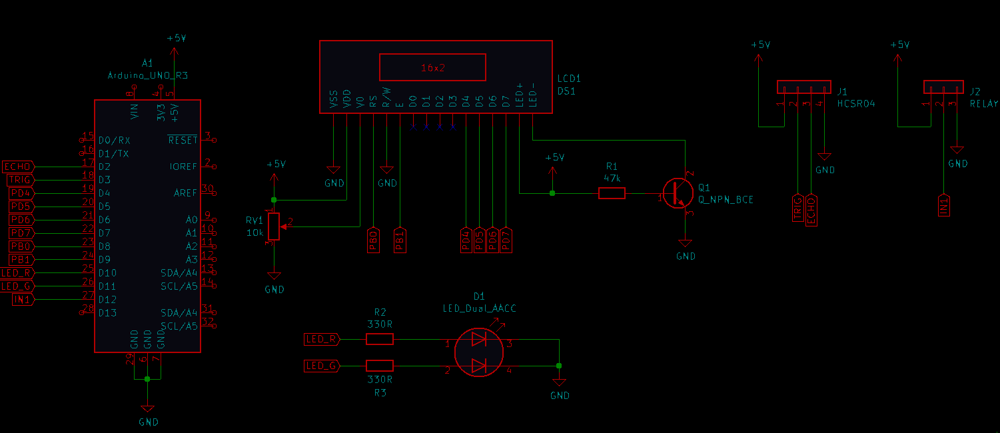
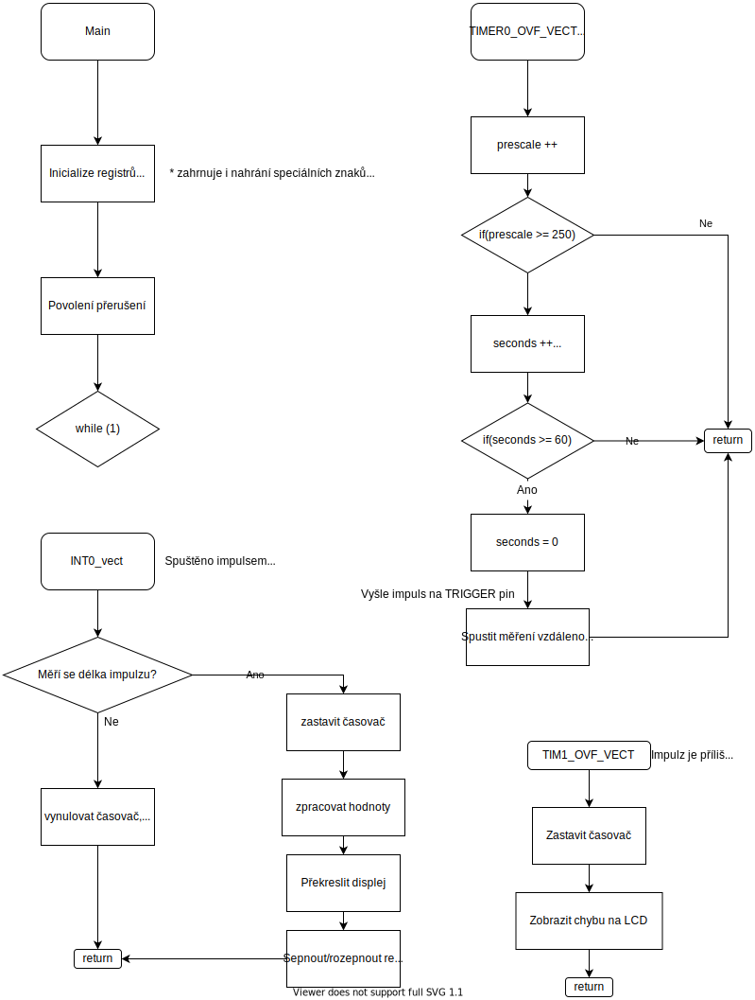

# Měření výšky vodní hladiny v nádrži

### Členové týmu

* Jan Bartoň
* Ondřej Dudášek
* Daniel Havránek
* Matěj Podaný

Odkaz na GitHub repozitář s projektem:

[https://github.com/ondrejdudasek/DE2-Project](https://github.com/ondrejdudasek/DE2-Project)

### Obsah

* [Cíle projektu](#objectives)
* [Popis hardwaru](#hardware)
* [Popis knihoven](#libs)
* [Popis zařízení](#main)
* [Závěr](#end)
* [Video](#video)
* [Reference](#references)

## Cíle projektu

Cílem projektu je vytvořit zařízení pro měření výšky hladiny ve vodní nádrži, spouštění čerpadla při dosažení určité výšky hladiny a detekci deště. 

* Měření výšky hladiny ve vodní nádrži
* Detekce deště
* Ovládání čerpadla na základě výšky hladiny
* Výstup na displej - výška hladiny, detekce deště

## Popis hardwaru

Řídící jednotkou projektu je Arduino UNO. Pro detekci výšky hladiny a deště byl použit ultrazvukový senzor HC-SR04. Ovládání čerpadla zajišťuje NC relé. Optický výstup zajišťuje LCD keypad shield a LED u relé.

## Popis knihoven

* avr/io.h - knihovna pro práci s mikrokontrolérem
* avr/interrupt - knihovna pro práci s přerušeními
* platform.h - abstrakční vrstva projektu, zpřehledňuje hlavní kód
* stdlib.h - obecná knihovna jazyka C
* util/delay - knihovna pro pozastavení programu na určitý čas
* timer.h - knihovna pro práci s časovači
* lcd.h - knihovna pro práci s LCD displejem
* lcd_definitons.h - definice pro knihovnu lcd.h
* gpio.h - knihovna pro práci se vstupy a výstupy
* uart.h - knihovna pro práci s komunikačním rozhraním UART

## Popis zařízení

K měření výšky hladiny nádrže se používá ultrazvukový senzor HC-SR4. Poté, co senzor obdrží trigger signál generovaný Arduinem o šířce 10 us, je ze senzoru vysláno osm pulzů ultrazvuku a následně přijde echo signál ze senzoru do arduina. Na základě délky echo signálu lze určit vzdálenost od objektu. Vzdálenost od vodní hladiny se poté přepočítá na výšku hladiny v nádrži. Uvažovaná hloubka nádrže jsou 2 m.

Čerpadlo se pustí, když je hladina výše jak 190 cm, což znamená 10 cm od senzoru. K sepnutí čerpadla dojde pomocí relé ovládaného Arduinem. K vypnutí relé, řídícího čerpadlo dojde v případě poklesu vodní hladiny na 150 cm, což znamená 50 cm od senzoru.

Detekce deště je opět realizována pomocí ultrazvukového senzoru v závislosti na tom, jestli hladina ve vodní nádrži roste. Vzhledem k přesnosti senzoru je povolená změna o jeden centimetr. 

Výstupem zařízení je LCD displej, na který se vypisuje výška hladiny a zda prší. Hloubku hladiny, kromě číselné délky, signalizuje i symbol nádrže, u něhož se mění výška hladiny. K signalizaci deště dochází pomocí symbolu mraku a kapek na displeji.

Zařízení aktualizuje hodnoty jednou za minutu. 

## Závěr

Podařilo se zapojit a naprogramovat zařízení pro detekci změny hladiny ve vodní nádrži a deště a spínání rele na základě výšky hladiny.

Rozšířením projektu by mohlo být vypisování více informací na displej, jako například stav čerpadla případně intenzita deště. Bylo by vhodné vyrobené zařízení otestovat v reálných podmínkách.

## Video

Odkaz na video:

[https://www.youtube.com/watch?v=aKqMvP25aIg&ab_channel=Mat%C4%9BjPodan%C3%BD](https://www.youtube.com/watch?v=aKqMvP25aIg&ab_channel=Mat%C4%9BjPodan%C3%BD)

## Reference
[Zadání projektu](https://github.com/tomas-fryza/Digital-electronics-2/tree/master/Labs/project)

[ATmega328P datasheet](https://ww1.microchip.com/downloads/en/DeviceDoc/ATmega48A-PA-88A-PA-168A-PA-328-P-DS-DS40002061B.pdf)

[Arduino UNO schematic](https://github.com/tomas-fryza/Digital-electronics-2/blob/master/Docs/arduino_shield.pdf)

[HC-SR04 datasheet](https://cdn.sparkfun.com/datasheets/Sensors/Proximity/HCSR04.pdf)

