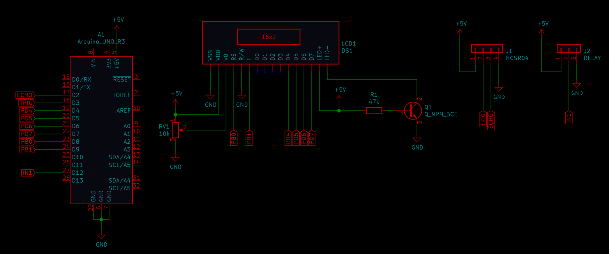

# Měření výšky vodní hladiny v nádrži

### Členové týmu

* Jan Bartoň
* Ondřej Dudášek
* Daniel Havránek
* Matěj Podaný

Link to this file in your GitHub repository:

[https://github.com/ondrejdudasek/DE2-Project](https://github.com/ondrejdudasek/DE2-Project)

### Obsah

* [Cíle projektu](#objectives)
* [Popis hardwaru](#hardware)
* [Popis knihoven](#libs)
* [Popis zařízení](#main)
* [Video](#video)
* [Reference](#references)

## Cíle projektu

* Měření výšky hladiny ve vodní nádrži
* Detekce deště
* Ovládání čerpadla na základě výšky hlaidny
* Výdtup na displej - výška hladiny, detekce deště, stav čerpadla
* Optická signalizace pomocí LED - TOBEDONE

## Popis hardwaru

Řídící jednotkou projektu je Arduino UNO. Pro detekci výšky hladiny byl použit ultrazvukový senzor HC-SR04. Ovládání čerpadla zajišťuje NC rele. Optický výstup zajišťuje výcebarvná LED a LCD kyepad shield.

## Popis knihoven

Write your text here.

## Popis zařízení

K měření výšky hladiny nádrže se používá ultrazvukový senzor HS-SR40. Poté, co senzor obdrží trigger signál generovaný arduinem o šířce 10 us, je ze senzoru vysláno osm pulzů ultrazvuku a následně přijde echo signál ze senzoru do arduina. Na základě délky echo signálu lze určit vzdálenost od objektu. Vzdálenost od vodní hladiny se poté přepočítá na výšku hladiny v nádrži. Uvažovaná hloubka nádrže jsou 2 m.

Čerpadlo se pustí když je hladina výš, jak 190 cm, což znamená 10 cm od senzoru. K sepnutí čerpadla dojde pomocí rele ovládaného arduinem. 

Detekce deště je opět realizována pomocí ultrazvukového senzoru v závislosti na tom, jestli hladina ve vodní nádrži roste. 

Výstupem zařízení je LCD displej, na který se vypisuje výška hladiny, stav čerpadla a zda prší. 

## Video

Write your text here

## Reference
[Zadání projektu](https://github.com/ondrejdudasek/DE2-Project)

[ATmega328P datasheet](https://ww1.microchip.com/downloads/en/DeviceDoc/ATmega48A-PA-88A-PA-168A-PA-328-P-DS-DS40002061B.pdf)

[Arduino UNO schematic](https://github.com/tomas-fryza/Digital-electronics-2/blob/master/Docs/arduino_shield.pdf)

[HC-SR04 datasheet](https://cdn.sparkfun.com/datasheets/Sensors/Proximity/HCSR04.pdf)

